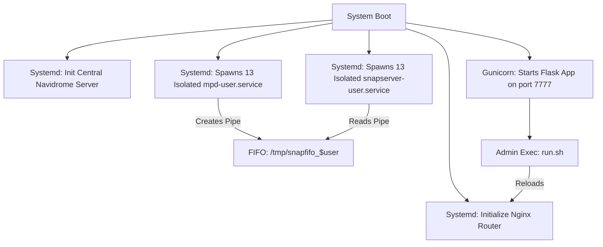
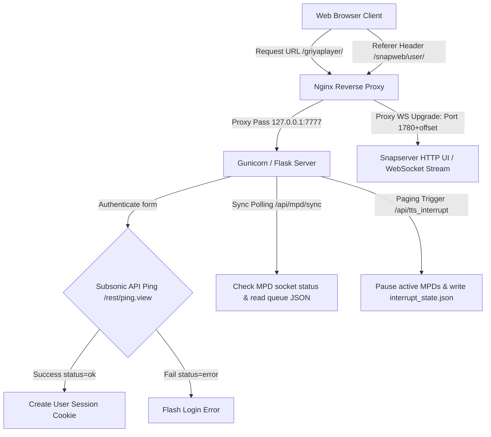
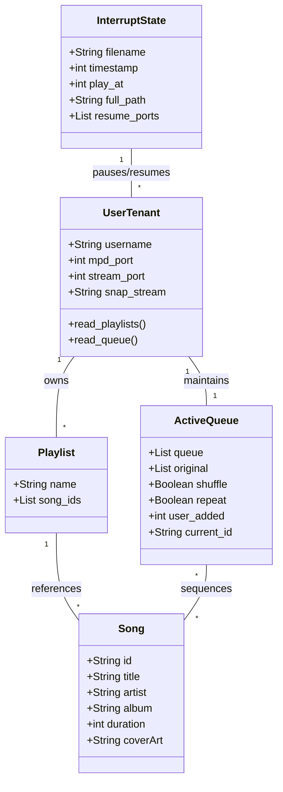

# MIND.md (Semantic Memory Index)

This file contains the machine-readable repository blueprint and semantic memory of this project. It is structured for rapid parsing, ingestion, and reasoning by future AI coding assistants.

---

# PROJECT IDENTITY

### 1. Definition
GriyaPlayer-Navidrome is a multi-tenant, multi-zone distributed audio distribution, scheduling, and remote-control platform deployed in the hospitality environment of Griya Persada Bandungan. It interfaces with a centralized **Navidrome Music Server** and coordinates multi-room synchronized audio broadcasting, dynamic fallback playback, and emergency paging.

### 2. Core Problem Solved
Traditional audio setups suffer from zone crosstalk, high configuration overhead, and lack of coordinated emergency messaging. This project solves this by:
* Isolating different rooms/zones into virtualized multi-tenant service stacks (MPD + Snapcast).
* Enabling dual-audio streaming (local browser playing via HTML5 audio versus remote speaker play synchronized over the network via Snapcast clients).
* Orchestrating a centralized emergency announcement pipeline that pauses all background audio instances, schedules a synchronized client-side and server-side warning play, broadcast-plays the announcement, and automatically resumes previous audio states upon completion.

### 3. Architecture Overview
The platform utilizes a decoupled, sidecar-style service architecture:
* **Gateway**: Nginx reverse-proxies requests, utilizing regex HTTP referer maps to multiplex WebSocket frames dynamically to corresponding user Snapserver HTTP ports.
* **Orchestrator**: A lightweight Flask backend bound to Gunicorn. It manages state files, executes commands on local MPD ports, stores multi-tenant playlists, and controls audio pipeline transitions.
* **Sound Engine**: 13 isolated, systemd or container-managed pairs of **Music Player Daemon (MPD)** and **Snapserver** instances. Each pair communicates via dedicated local loopback ports and Unix Named Pipes (FIFOs).
* **Media Cache & Pipelines**: Navidrome acts as the media database (optionally container-hosted), while sidecar Python scripts automate background audio compression (downsampling to 128kbps) and metadata duplicate cleansing.

### 4. Conventions & Technologies
* **Backend**: Python 3.x (Flask, Gunicorn, MPDClient, Edge-TTS, Asyncio, Requests, Mutagen).
* **Frontend**: Vanilla JS (Dual Audio Engines: HTML5 `<audio>` for device mode and local WebSocket receivers for Snapweb), custom CSS layout (Inter typography, CSS custom properties, responsive panels).
* **Sound Infrastructure**: MPD, Snapserver (Snapcast), Unix FIFOs, Systemd / Docker configurations.
* **Web Proxy**: Nginx.
* **Conventions**: Databases are avoided to prevent file locks. Session, playlist, and queue persistences are handled via local filesystem serialization (`.json`). Port allocations scale strictly via arithmetic offsets based on a central configuration mapping.

---

# MENTAL MODEL

When working on this repository, model the architecture as a **stateless, sidecar-isolated multi-tenant controller**.

```
[Web UI (player.html / player.js)]
   │
   ├── isPlayAlone = true  ──> (Device Mode)  ──> Direct HTML5 Client Audio (from Navidrome Port 4533)
   │
   └── isPlayAlone = false ──> (Room Mode)    ──> Connects to Flask Orchestrator API (Port 7777)
                                                          │
                                                          ├── Command MPD Instance (localhost:660X)
                                                          │      │
                                                          │      ├── Web Stream (HTTP Port 800X)
                                                          │      └── Unix FIFO Pipe (/tmp/snapfifo_user)
                                                          │             │
                                                          │             └── Snapserver (Ports 170X/175X/178X)
                                                          │
                                                          └── Interrupt Dispatcher (Global Broadcast)
                                                                 │
                                                                 └── Write interrupt_state.json
```

### Key Principles:
1. **Separation of Modes**: The client is either in *Device Mode* (decentralized, browser-owned HTML5 audio player) or *Room Mode* (centralized, server-owned MPD/Snapcast audio output).
2. **Stateless Operations**: No SQL/NoSQL databases are present.
   * Playlists are saved to `[username].json`.
   * Queues are saved to `antrian/antrian_[username].json`.
   * Active interruptions are recorded in `interrupt_state.json`.
3. **Zone Isolation**: A tenant has no authority over another tenant's MPD or Snapserver configurations except in **Outlet Play** mode (read-only playlist inspection) and **Admin/Global Interrupt** operations.
4. **Referer-Based Upgrades**: All local client WebSocket streaming requests are sent to Nginx under `/jsonrpc` or `/stream` paths. Nginx resolves the user's zone by parsing the `Referer` header and proxies the upgrade to the matching Snapserver HTTP port.

---

# ARCHITECTURE GRAPH

### 1. Application Startup Sequence


### 2. Request Lifecycle & Routing Map


---

# DOMAIN GRAPH



---

# MODULE GRAPH

### 1. Flask API Engine
* **Files**: [app.py](file:///G:/Project_magang/GriyaPlayer-Navidrome/app.py) & [config.py](file:///G:/Project_magang/GriyaPlayer-Navidrome/config.py)
* **Purpose**: Backend server orchestration.
* **Responsibilities**: Proxy requests to Navidrome subsonic server, handle authentication, manage active queue states, write playlist files, execute MPD socket control via python-mpd2, and handle emergency paging.
* **Dependencies**: `config.py` definitions, `requests` library, `MPDClient` module.
* **Consumers**: Frontend JavaScript web requests.

### 2. Infrastructure Provisions
* **Files**: [setup_mpd_users.sh](file:///G:/Project_magang/GriyaPlayer-Navidrome/setup_mpd_users.sh), [setup_snapserver.sh](file:///G:/Project_magang/GriyaPlayer-Navidrome/setup_snapserver.sh), & [setup_nginx.sh](file:///G:/Project_magang/GriyaPlayer-Navidrome/setup_nginx.sh)
* **Purpose**: Multi-tenant daemon provisioning.
* **Responsibilities**:
  * Set up 13 systemd units for MPD listening on control ports `6600-6612` and HTTP ports `8000-8012`.
  * Set up 13 systemd units for Snapserver listening on ports `1700-1712` (Control), `1750-1762` (TCP Stream), and `1780-1792` (HTTP Web).
  * Configure Nginx mapping block to dynamically switch target websocket stream channels based on browser Referer HTTP header matching.
* **Dependencies**: Systemd, Nginx, MPD, Snapserver core binary files.
* **Consumers**: Server Operating System execution, Web UI connections.

### 3. Client UI & Dual Engine Controllers
* **Files**: [player.html](file:///G:/Project_magang/GriyaPlayer-Navidrome/templates/player.html), [player.js](file:///G:/Project_magang/GriyaPlayer-Navidrome/static/player.js), & [responsive.css](file:///G:/Project_magang/GriyaPlayer-Navidrome/static/responsive.css)
* **Purpose**: User interface dashboard and media player engine.
* **Responsibilities**: Manage local queues, perform seek operations, change play modes, query list pagination, recovery localStorage states, start/stop audio, and coordinate the broadcast warning overlays.
* **Dependencies**: Boxicons CSS, Google Inter fonts, Browser Web Audio HTML5 APIs.
* **Consumers**: Client-side end users.

---

# EXECUTION PATHS

### 1. User Session Auth Flow
1. Client submits credentials via [login.html](file:///G:/Project_magang/GriyaPlayer-Navidrome/templates/login.html).
2. [app.py:login()](file:///G:/Project_magang/GriyaPlayer-Navidrome/app.py) intercept:
   * Generates a 6-character random string (`salt`).
   * Computes md5 token: `md5(password + salt)`.
   * Sends token-based HTTP verification ping to Navidrome Subsonic endpoint: `http://192.168.4.40:4533/rest/ping.view`.
3. If response status is `'ok'`, stores `username` and `password` in flask `session` container and redirects user to [player.html](file:///G:/Project_magang/GriyaPlayer-Navidrome/templates/player.html).

### 2. Client Synchronization Long-Polling
1. Browser client initializes `startApp()` which runs `setInterval(syncLoop, 1000)`.
2. `syncLoop()` sends GET query to `/api/mpd/sync`.
3. Flask server connects to user's MPD socket using the mapped port from `USER_CONFIGS`:
   * Retrieves `status()` and `currentsong()`.
   * Reads active playlist queues from `/antrian/antrian_[username].json`.
   * Checks for presence of `interrupt_state.json`.
4. Returns JSON data to browser. If `interrupt` key is populated with a fresh timestamp, client pauses local audio, displays red alert overlay, and executes emergency audio warning sequences.

### 3. Emergency Announcement Play & Auto-Resume
1. Admin triggers a paging request (e.g. POST `/api/tts_interrupt` with text).
2. Flask synthesizes the text to an MP3 announcement via `edge_tts` and writes the file to `/static/uploads/`.
3. Flask queries all 13 MPD ports using socket connections:
   * If a port status is currently `play`, pauses execution (`pause(1)`) and appends the port number to a `resume_ports` list.
4. Flask writes a state file: `interrupt_state.json` holding `{filename, play_at: server_time + 3000ms, resume_ports}`.
5. All active client browsers detect this interrupt during their next sync loop:
   * Red warning screen overlays the viewport.
   * Browser plays `static/opening.mp3` immediately.
   * Executes a timed delay (`play_at - server_time`) and plays the announcement file simultaneously.
   * Plays `static/closing.mp3`.
6. Client makes request to `/api/clear_interrupt`. Flask removes the `interrupt_state.json` file and connects to every MPD socket in `resume_ports` sending the resume instruction (`pause(0)`).

---

# DEPENDENCY CHAINS

```
[Browser Client]
       │
       ├── (HTTP / JSON API Requests) ──> [Nginx Gateway (Port 80)]
       │                                         │
       │                                         └── [Gunicorn/Flask (Port 7777)]
       │                                                    │
       │                                                    ├── [Local Queue JSON Files]
       │                                                    └── [MPD Control Sockets (6600-6612)]
       │
       └── (Direct Device Mode Audio) ──> [Navidrome Media Engine (Port 4533)]
                                                 │
                                                 └── [Raw Music Directories]
```

### Core Operations Dependencies:
* **Audio Pipelines**: MPD Instances read music directly from Navidrome via HTTP streaming URLs (`/rest/stream...`) in Room Mode.
* **Sync Dependencies**: Nginx maps upgrade headers dynamically based on Referer regex matching to proxy the Snapcast client WebSocket to `localhost:1780` through `1792` dynamically.
* **Text-to-Speech**: edge-tts generates offline speech synthesized MP3 files which rely on Microsoft's Azure GadisNeural voice engines, saved directly to `/static/uploads/`.

---

# IMPORT HOTSPOTS

### 1. config.py
* **Type**: Configuration file.
* **Why it is central**: It defines the entire multi-tenant topology. Modifying user configurations, adding rooms, or shifting control ports requires updating `USER_CONFIGS` here. All services use this mapping to coordinate routing.

### 2. MPD Sockets Control
* **Type**: Dependency (`from mpd import MPDClient` in `app.py`).
* **Why it is central**: It is the single interface used by the orchestrator to check statuses, play songs, skip tracks, trigger pause instructions during overrides, and recover playback zones.

### 3. Local JSON Storage Directories
* **Type**: File system pathways (`/antrian/antrian_[user].json` and `[user].json` in base directory).
* **Why it is central**: They act as the database layer. Every queue change, shuffle toggle, repeat configuration, and playlist entry read/write is serialized here.

---

# KNOWLEDGE GRAPH

```
GriyaPlayer Workspace
├── Backend Orchestrator
│   ├── app.py (Main Routing, API Proxies, Queue & Paging Execution)
│   └── config.py (Multi-tenant User, Port, and Host mappings)
├── Frontend UI
│   ├── templates
│   │   ├── login.html (Direct Subsonic Auth interface form)
│   │   └── player.html (Spotify Dashboard Layout & UI controls)
│   └── static
│       ├── player.js (Dual Audio Core Logic, Polling Sync loop, Interrupt Playback)
│       ├── login.js (Basic login checks)
│       ├── login.css (Dark UI system design tokens)
│       └── responsive.css (Mobile UI display transformations)
├── Provisioning Scripts
│   ├── setup_mpd_users.sh (Autogenerates isolated MPD systemd services)
│   ├── setup_snapserver.sh (Autogenerates isolated Snapserver configurations)
│   └── setup_nginx.sh (Configures Referer-based WebSocket Dynamic Proxies)
└── Offline Utilities
    ├── compres.py (FFmpeg 128kbps audio downsampler)
    └── cekdupe.py (Mutagen audio file ID3 duplicate check tool)
```

---

# AI NAVIGATION

Future AI coding assistants modifying parts of the codebase should refer to these navigation maps:

### 1. Modifying Playback Modes or Audio Engines
```
[Identify Target Engine]
   │
   ├── Client-Side (Device Mode) ──> Modify player.js (attachAudioEvents, restoreLocalState)
   │
   └── Server-Side (Room Mode)   ──> Modify app.py (api /api/mpd/cmd, sync logic) & config.py USER_CONFIGS
```

### 2. Adjusting Network Services, Port Allocation, or Routing
```
[Update Central Ports]
   │
   ├── Edit config.py (USER_CONFIGS ports)
   ├── Edit setup_mpd_users.sh (Systemd template values)
   ├── Edit setup_snapserver.sh (WebSocket & control bindings)
   └── Edit setup_nginx.sh (Update mapping blocks)
```

### 3. Editing Emergency Announcement or Paging Logic
```
[Interrupt Chain Flow]
   │
   ├── Server-Side Synthesis  ──> Modify app.py (/api/tts_interrupt, /api/trigger_interrupt, clear_interrupt)
   │
   └── Client-Side Execution ──> Modify player.js (syncLoop, triggerInterruptUI, cancelInterruptAdmin)
```

---

# PROJECT RULES

1. **Incremental Port Assigning**: Always align MPD control, MPD stream, Snapcast control, Snapcast TCP, and Snapcast HTTP web ports using the base `offset` logic configured in `config.py` to prevent service collisions.
2. **Database-Free Architecture**: Never introduce SQLite, MySQL, Postgres, or MongoDB dependencies. Persistent storage must remain serialized in standard JSON format in user configuration files.
3. **Session-Bound Subsonic Actions**: Never execute Navidrome API calls directly without parsing credentials using `get_navidrome_params()`.
4. **Gapless Queue Manipulation**: When modifying active MPD queues dynamically during playback, do not call `clear()`. Instead, isolate and remove inactive song IDs (`c.deleteid()`) to preserve uninterrupted background playback.
5. **Absolute Sync Timestamps**: When initiating an audio override, always embed a `play_at` absolute server millisecond timestamp delayed by exactly `3000ms` into `interrupt_state.json` to allow client browsers and network clients to align play starts.
6. **Admin-Only Broadcast Permissions**: Restrict write access to the interrupt pipeline endpoints (`/api/tts_interrupt`, `/api/upload_interrupt`, `/api/trigger_interrupt`, `/api/delete_interrupt`) by verifying that the authenticated session username is either `admin` or `griyapersada`.

---

# TOKEN OPTIMIZATION

For context management in LLM-based development:

### 1. Essential Context (Always Load)
* [config.py](file:///G:/Project_magang/GriyaPlayer-Navidrome/config.py): The mapping structure of the app.
* [app.py](file:///G:/Project_magang/GriyaPlayer-Navidrome/app.py): The main execution hub.

### 2. UI & Frontend Logic Context (Load only for UI issues)
* [templates/player.html](file:///G:/Project_magang/GriyaPlayer-Navidrome/templates/player.html): HTML UI element declarations.
* [static/player.js](file:///G:/Project_magang/GriyaPlayer-Navidrome/static/player.js): UI state and sync actions.

### 3. Ignore Paths (Never Load)
* `Backup V1.0/`, `Backup V2.0/`, `Backup V3.0/` (Archived backups).
* `web_player.log` (Runtime log files).
* `antrian/*.json` (Ephemeral active user queues).
* `static/uploads/*.mp3` (Generated announcements).
* `static/*.png` / `static/*.mp3` (Static asset files).
* `navidrome_data/` (Local Navidrome container files database).
* `music/` and `music_compressed/` (Raw and downsampled music folder contents).

---

# AI MEMORY

GriyaPlayer-Navidrome is a multi-tenant, zone-isolated audio streaming platform designed for hospitality distribution. The system manages background music delivery and emergency announcements across 13 isolated zones using a sidecar pattern of MPD and Snapserver services.

The platform exposes two play mechanisms. **Device Mode** plays audio directly in the browser by streaming tracks from the centralized Navidrome subsonic API, tracking states locally via Javascript and localStorage. **Room Mode** delegates audio decoding to systemd-managed MPD daemons in the backend. These daemons output to local HTTP ports for direct playback, and to Unix FIFO pipes `/tmp/snapfifo_$user` which feed isolated Snapcast instances. The Snapcast servers then broadcast synchronized PCM audio over TCP channels to network speaker endpoints. Dynamic browser WebSocket routing to these individual Snapserver instances is managed at the gateway level by an Nginx reverse proxy mapping client HTTP Referer headers.

Emergency broadcast overrides represent a critical pipeline in the architecture. When triggered, the backend halts all active background MPD streams, saves the warning details to `interrupt_state.json` with a coordinated execution delay, and broadcasts the event. Client browsers polling the synchronizer route detect the warning, display alert screens, play coordinated opening, warning, and closing audio files, and then request a state reset which resumes previous play sessions. 

Persistences are managed entirely database-free, relying on local filesystem serialization of queues and playlist entries to user-specific JSON files, avoiding lockups and maintaining service reliability. All configurations follow a strict arithmetic port mapping convention to guarantee zero zone crosstalk.
