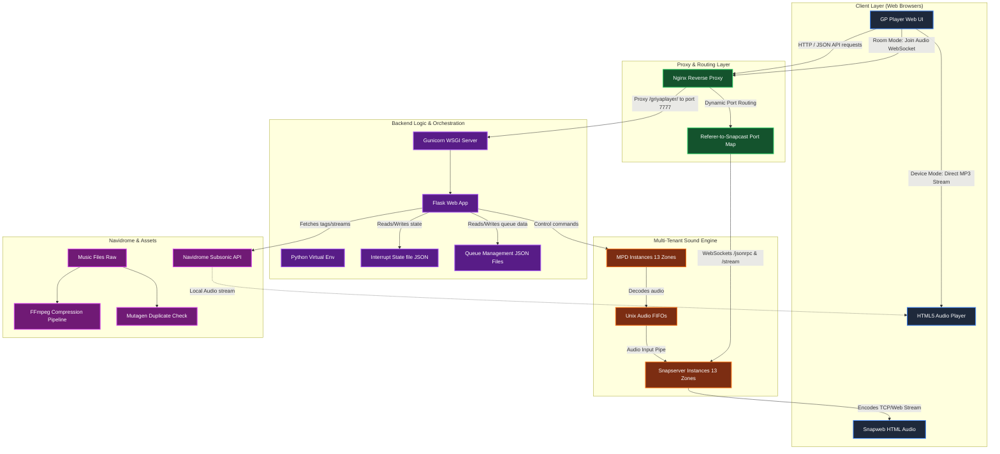
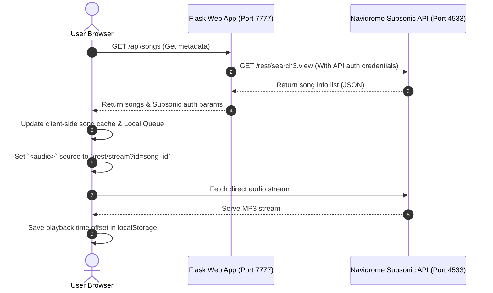
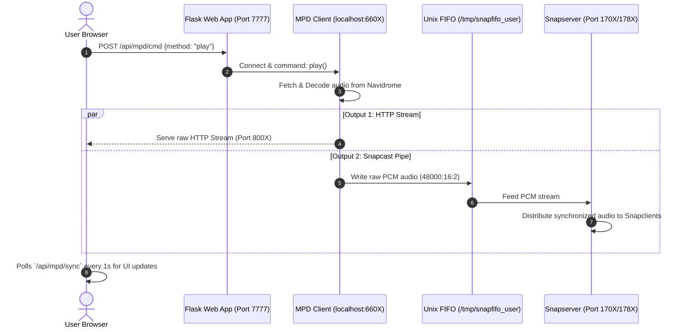

# GriyaPlayer-Navidrome 🎧

GriyaPlayer-Navidrome is a multi-tenant, multi-zone distributed audio streaming and remote-control platform designed for the Griya Persada hotel/resort environment. It integrates a central **Navidrome Music Server** with multiple independent **Music Player Daemon (MPD)** instances, isolated **Snapcast (Snapserver)** audio distribution nodes, a **Flask Orchestrator Web App**, and an **Nginx Reverse Proxy** with referer-based dynamic routing.

---

## 🗺️ System Architecture & Boundaries

The following semantic graph demonstrates the system boundaries, network layers, and data flow pipelines between the frontend web client, the orchestrator backend, the Nginx router, the audio services, and the Navidrome media database.



---

## 🎛️ Dual Playback Modes

The platform supports two distinct audio playback architectures: **Device Mode (Local Client-Side)** and **Room Mode (Synchronized Network-Side)**.

### 1. Device Mode (`DEVICE INI`)
* **Core Logic**: Client-side playback.
* **Mechanism**: 
  * The browser pulls audio directly from the Navidrome Subsonic API endpoint (`/rest/stream`).
  * Playback states (current queue, shuffle mode, repeat, and seek offsets) are managed entirely by Javascript inside the browser (`player.js`).
  * Session recovery is persisted in `localStorage` (`gp_local_state`, `gp_local_time`).
  * Browser audio element (`<audio>`) handles decoding and output.



### 2. Room Mode (`RUANGAN`)
* **Core Logic**: Server-side multi-tenant remote control.
* **Mechanism**: 
  * The browser plays **no local audio** and functions purely as a remote control.
  * Flask delegates playback execution to the user's corresponding backend **MPD instance** (listening on ports `6600-6612`).
  * MPD streams audio from Navidrome, decodes it, and splits it into two outputs:
    1. A raw PCM audio pipe (`48000Hz:16bit:2ch`) routed to a Unix FIFO file (`/tmp/snapfifo_$user`).
    2. A standalone HTTP stream (`44100Hz:16bit:2ch`) encoded in MP3 (192kbps) served directly on ports `8000-8012`.
  * **Snapserver** reads the Unix FIFO and broadcasts synchronized audio via TCP (ports `1750-1762`) to network hardware receivers (e.g., Raspberry Pi players in ceiling speakers).
  * **Browser Cross-Listening**: Clicking **Join Audio** opens a WebSocket connection through Nginx (port `80` dynamically mapped to Snapserver HTTP Ports `1780-1792`), decoding synchronized audio inside the browser.



---

## 📢 Global Broadcast Interrupt (Emergency Paging) System

An emergency paging or Text-to-Speech announcement halts background music in all hotel zones, broadcasts the message simultaneously across all network devices, and automatically resumes previous audio queues once the paging concludes.

### Paging Sequence Flow:

```mermaid
sequenceDiagram
    autonumber
    actor Admin as Admin Browser
    participant Server as Flask Web App (Port 7777)
    participant State as interrupt_state.json
    participant MPD as MPD Instances (All Zones)
    actor Client as Client Browsers (All Zones)
    
    Admin->>Server: POST /api/tts_interrupt {text: "Attention please..."}
    Note over Server: Generate TTS audio file via Edge-TTS
    Server->>Server: Save announcement as `tts_broadcast_timestamp.mp3`
    
    rect rgb(40, 10, 10)
        Note over Server, MPD: Pause music in all zones
        loop For each tenant in USER_CONFIGS
            Server->>MPD: Check playback state. If playing, pause & add port to resume list
        end
    end
    
    Server->>State: Write {filename, timestamp, play_at (delay +3s), resume_ports}
    Server-->>Admin: Return success
    
    Note over Client, Server: Polling Sync loop detects announcement
    loop Every 1 second
        Client->>Server: GET /api/mpd/sync
        Server->>State: Check for interrupt state
        State-->>Server: Return active interrupt details
        Server-->>Client: Send state {interrupt: {filename, play_at, ...}}
    end

    rect rgb(50, 0, 0)
        Note over Client: Lock Web UI controls & show red warning screen
        Client->>Client: Play opening.mp3 (Jingle)
        Note over Client: Calculate latency delay (play_at - server_time)
        Client->>Client: Play main announcement MP3 at identical timestamp
        Client->>Client: Play closing.mp3 (Jingle)
    end
    
    alt Automatic Finish or Admin Cancel
        Client->>Server: POST /api/clear_interrupt
    else Admin Explicit Force Cancel
        Admin->>Server: POST /api/clear_interrupt
    end
    
    Server->>State: Delete interrupt_state.json
    rect rgb(10, 40, 10)
        Note over Server, MPD: Resume previous music
        loop For each port in resume_ports
            Server->>MPD: Command: pause(0) (Resume)
        end
    end
```



---

## 🗂️ Module Index & File Structure

Below is the semantic mapping of files to architectural components and roles:

### 1. Orchestration & Core Logic (Backend)
* [app.py](file:///G:/Project_magang/GriyaPlayer-Navidrome/app.py): The main entry point. Initializes Flask, mounts `ProxyFix` middleware, implements Navidrome Subsonic proxying, multi-room remote controllers, gapless queue updates, multi-tenant JSON playlist management, and the emergency paging broadcast.
* [config.py](file:///G:/Project_magang/GriyaPlayer-Navidrome/config.py): Core configurations. Holds encryption secret keys, the Navidrome server address, and the multi-tenant `USER_CONFIGS` dictionary containing control ports, streaming ports, and Snapcast stream identifiers.
* [run.sh](file:///G:/Project_magang/GriyaPlayer-Navidrome/run.sh): A startup shell script that terminates processes bound to port `7777`, activates the Python virtual environment, boots the WSGI container (Gunicorn) with 4 workers and 2 threads in daemon mode, and reloads Nginx.

### 2. Infrastructure & Auto-Provisioning (System Scripts)
* [setup_mpd_users.sh](file:///G:/Project_magang/GriyaPlayer-Navidrome/setup_mpd_users.sh): Automatically creates directory structures, system users, and pipes for 13 distinct MPD instances. Auto-generates independent configuration files (`/etc/mpd_$user.conf`) with optimizations (e.g., audio buffer 4096, metadata disabled, curl plugin custom timeout) and registers individual systemd daemon scripts.
* [setup_snapserver.sh](file:///G:/Project_magang/GriyaPlayer-Navidrome/setup_snapserver.sh): Installs snapserver, updates `snapweb` user permissions, and provisions 13 individual configurations (`/etc/snapserver_$user.conf`). Configures pipe paths, websocket ports, TCP streaming channels, and systemd units for all tenants.
* [setup_nginx.sh](file:///G:/Project_magang/GriyaPlayer-Navidrome/setup_nginx.sh): Modifies `/etc/nginx/sites-available/default` to register reverse-proxy mappings. Features a dynamic mapping block that resolves browser `http_referer` headers to redirect `/jsonrpc` and `/stream` websocket endpoints to the correct tenant's Snapserver.

### 3. Media Pipeline & Processing (Scripts)
* [compres.py](file:///G:/Project_magang/GriyaPlayer-Navidrome/compres.py): An offline audio conversion utility. Scans a directory structure using `ffprobe` to determine bitrate. Compresses high-bitrate or lossless audio (FLAC, WAV, M4A, MP3) down to `128kbps` fixed bitrate, `44100Hz`, using the `libmp3lame` codec with genpts flags to fix corrupted timestamps.
* [cekdupe.py](file:///G:/Project_magang/GriyaPlayer-Navidrome/cekdupe.py): A utility to locate duplicate audio files. Walks directories, parses ID3 metadata with the `mutagen` library, lists duplicates, and offers prompts to remove duplicate files while keeping the original.

### 4. Interface (Frontend Templates & Static Assets)
* [templates/player.html](file:///G:/Project_magang/GriyaPlayer-Navidrome/templates/player.html): The main responsive dashboard template. Follows Spotify's layout: includes sidebar navigation, current playing metadata info bar, seek sliders, volume controls, room selector modal, and dynamic panels.
* [templates/login.html](file:///G:/Project_magang/GriyaPlayer-Navidrome/templates/login.html): The login screen template. Authenticates directly against Navidrome by forwarding credentials through Subsonic authentication methods.
* [static/player.js](file:///G:/Project_magang/GriyaPlayer-Navidrome/static/player.js): The frontend core code (approx. 1,900 lines). Controls the dual audio engine, handles dynamic pagination loading for songs, communicates with Flask API endpoints, manages playlist manipulation, operates the polling sync loop, and directs the multi-track announcement broadcast sequence.
* [static/login.js](file:///G:/Project_magang/GriyaPlayer-Navidrome/static/login.js): Handles basic login actions, input checks, and screen submission.
* [static/login.css](file:///G:/Project_magang/GriyaPlayer-Navidrome/static/login.css) & [responsive.css](file:///G:/Project_magang/GriyaPlayer-Navidrome/static/responsive.css): Curated CSS sheets providing dark aesthetics, modern typography layout (Inter font), grid alignments, animations, and custom styling rules for sliders and control bars.

---

## 🔀 Multi-Tenant Config & Network Port Mapping

Each user profile is tied to dedicated, isolated services in the backend to ensure zero crosstalk. The mapping layout is configured as follows:

| Tenant / Zone (Username) | MPD Control Port | HTTP Web Stream Port | Snapcast Control Port | Snapcast TCP Stream | Snapcast HTTP Web UI |
| :--- | :---: | :---: | :---: | :---: | :---: |
| **griyapersada** | 6600 | 8000 | 1700 | 1750 | 1780 |
| **jagat** | 6601 | 8001 | 1701 | 1751 | 1781 |
| **dialog** | 6602 | 8002 | 1702 | 1752 | 1782 |
| **hugo** | 6603 | 8003 | 1703 | 1753 | 1783 |
| **khayangan** | 6604 | 8004 | 1704 | 1754 | 1784 |
| **oobakso** | 6605 | 8005 | 1705 | 1755 | 1785 |
| **maruti** | 6606 | 8006 | 1706 | 1756 | 1786 |
| **ramashinta** | 6607 | 8007 | 1707 | 1757 | 1787 |
| **lokalfarm** | 6608 | 8008 | 1708 | 1758 | 1788 |
| **fo** | 6609 | 8009 | 1709 | 1759 | 1789 |
| **vgm** | 6610 | 8010 | 1710 | 1760 | 1790 |
| **anjani** | 6611 | 8011 | 1711 | 1761 | 1791 |
| **pancasona** | 6612 | 8012 | 1712 | 1762 | 1792 |

---

## ⚙️ Deployment & Auto-Provisioning

### Method A: Docker Compose Deployment (Recommended)
This method installs and configures Nginx, the Python Web Player, 13 MPD servers, 13 Snapservers, and the central Navidrome instance in a single command.

1. **Clone this repository** to your host machine.
2. **Build and start the services**:
   ```bash
   docker compose build
   docker compose up -d
   ```
3. **Set up music files**:
   * Drop your `.mp3` or `.flac` files inside the `./music` folder created in your project root.
4. **Access the application**:
   * **Navidrome Server**: [http://localhost:4533/](http://localhost:4533/) (Set up your admin and user accounts here first).
   * **GriyaPlayer Web App**: [http://localhost/griyaplayer/](http://localhost/griyaplayer/) (Log in using the credentials created in Navidrome).

---

### Method B: Manual Linux VM Deployment (Native Systemd)
To deploy this setup natively on a fresh Ubuntu Server instance (`192.168.4.40`):

1. **Clone & Setup directory structure**:
   ```bash
   sudo mkdir -p /var/www/navidrome/web
   # Copy the codebase contents into this directory
   ```

2. **Initialize Python Virtual Environment**:
   ```bash
   cd /var/www/navidrome/web
   python3 -m venv venv
   source venv/bin/activate
   pip install -r requirements.txt # Requires: Flask, requests, python-mpd2, edge-tts, gunicorn
   ```

3. **Provision MPD Instances**:
   ```bash
   sudo chmod +x setup_mpd_users.sh
   sudo ./setup_mpd_users.sh
   ```

4. **Provision Snapservers**:
   ```bash
   sudo chmod +x setup_snapserver.sh
   sudo ./setup_snapserver.sh
   ```

5. **Provision Nginx Web Router**:
   ```bash
   sudo chmod +x setup_nginx.sh
   sudo ./setup_nginx.sh
   ```

6. **Start Flask Web App via Gunicorn**:
   ```bash
   sudo chmod +x run.sh
   sudo ./run.sh
   ```
   * The web application is now active at `http://192.168.4.40/griyaplayer/`.

